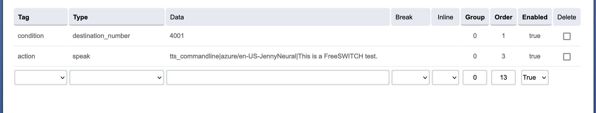

# Setup


## IVRS

### Setup `mod_tts_commandline`

```
cd /usr/src/freeswitch/src/mod/asr_tts/mod_tts_commandline
make install
```

Enable the newly installed module in FusionPBX under `Advanced` > `Modules` > `Speech Recognition / Text to Speech`

### Install tts

Install the `tts` program using [following the instructions](https://github.com/JoyceBabu/tts#build) for your operating system.

```
git clone https://github.com/JoyceBabu/tts
go build
```

Copy generated binary to `/usr/local/bin/tts` on PBX server.

Copy the script `tts-wrapper` to `/usr/local/bin/tts-wrapper` 
```
wget -O /usr/local/bin/tts-wrapper https://raw.githubusercontent.com/JoyceBabu/tts/master/freeswitch/tts-wrapper
chmod +x /usr/local/bin/tts-wrapper
```

Edit the file and update your Google / Azure credentials.

Update `/etc/freeswitch/autoload_configs/tts_commandline.conf.xml` to use the `tts-wrapper` script that we just created.

```xml
<configuration name="tts_commandline.conf" description="TextToSpeech Commandline configuration">
    <settings>
        <!--
        Some variables will be replaced :
        ${text}: input text (quoted)
        ${rate}: sample rate (example: 8000)
        ${voice}: voice_name passed to TTS(quoted)
        ${file}: output file (quoted, including .wav extension)

    Example commands can be found at:
    http://wiki.freeswitch.org/wiki/Mod_tts_commandline#Example_commands
        -->
        <!--param name="command" value="echo ${text} | text2wave -f ${rate} > ${file}"/-->
        <param name="command" value="echo ${text} | /usr/local/bin/tts-wrapper -r ${rate} -o ${file} -v ${voice}"/>
    </settings>
</configuration>
```

## Usage

### Dialplan

Configure dialplan to use the new tts module using the `speak` action.



### Lua

To use the new tts module from Lua script call `session:set_tts_params`

```lua
session:set_tts_params("tts_commandline", "google/en-US-Wavenet-A");
session:speak("Hello World!")
```

